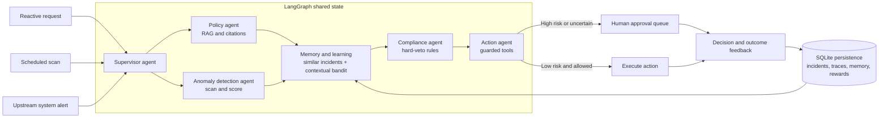

# Agentic HCM Workflow Engine

The Agentic HCM Workflow Engine is a self-healing HR operations platform that answers
natural-language employee and manager requests, proactively scans workforce data for payroll,
leave, and compliance anomalies, and investigates alerts from upstream payroll or attendance
systems. Across reactive, scheduled, and system-generated triggers, it grounds answers in HR
policy, executes guarded tool actions, sends high-risk decisions to human reviewers, enforces
compliance rules as hard vetoes, remembers past incidents, and uses a persisted contextual
bandit to improve future action proposals from reviewer decisions and operational outcomes.

All LLM inference uses OpenRouter's free `openai/gpt-oss-120b:free` model. All embeddings use
`Qwen/Qwen3-Embedding-8B` through `sentence-transformers`.

## Repository overview

```text
agentic-hcm-workflow-engine/
├── README.md                 Project guide, architecture, setup, and operating notes
├── app.py                    Streamlit UI for requests, scans, approvals, and learning
├── DEMO_TRANSCRIPT.md        Recording-ready product walkthrough
├── pyproject.toml            Dependencies, CLI entry point, and tool configuration
├── docs/
│   └── KEY_DESIGN_DECISIONS.md  Architecture and implementation rationale
├── src/
│   ├── engine.py             Public facade and conversational LangGraph
│   ├── workflow.py           Shared-state self-healing workflow
│   ├── learning.py           Contextual-bandit action selection
│   ├── memory.py             Episodic vector memory for resolved incidents
│   ├── rag.py                Policy chunking, embeddings, retrieval, and persisted index
│   ├── state.py              SQLite sessions, incidents, approvals, traces, and rewards
│   ├── tools.py              Guarded mock HR tool contracts and implementations
│   ├── evaluation.py         Fifteen-case evaluation harness
│   └── agents/
│       ├── supervisor_agent.py
│       ├── policy_agent.py
│       ├── anomaly_detection_agent.py
│       ├── compliance_agent.py
│       └── action_agent.py
├── data/
│   ├── tech_company_employee_data_1000_with_leave.csv
│   ├── hr_policy_corpus.txt
│   ├── compliance_rules.json
│   └── mock_api_spec.yaml
└── tests/                    Deterministic offline unit and workflow tests
```

## Architecture



Agents do not call one another directly. LangGraph passes every handoff through shared graph
state, and SQLite persists transitions, incidents, approvals, feedback, episodic memory, and
learned rewards. Compliance runs after the learned proposal, so neither the supervisor nor the
learning policy can bypass a hard veto.

The policy corpus is split at Markdown section headings. Oversized sections are windowed at
220 words with a 35-word overlap. Heading text is embedded with each body chunk so short,
topic-oriented questions retain strong semantic signals. Embeddings are normalized, persisted
to `data/policy_index.npz`, and rebuilt only when the corpus or embedding model changes.

## Setup and run

Python 3.11 or 3.12 is recommended. Qwen3-Embedding-8B is a large model, so the first run
downloads substantial model weights and works best on a machine with adequate RAM or GPU memory.

```bash
cd /Users/pratik/Documents/agentic-hcm-workflow-engine
python3.11 -m venv .venv
source .venv/bin/activate
pip install -e ".[dev]"
cp .env.example .env
```

Set `OPENROUTER_API_KEY` in `.env`.

### Run the web application

```bash
streamlit run app.py
```

Open the URL printed by Streamlit, normally `http://localhost:8501`. The UI provides four
workspaces: Ask HR, Detection, Review queue, and Learning.

### Run from the CLI

```bash
hcm-agent "What is the policy on outside employment?" --trace
hcm-agent "Apply for annual leave from 2026-07-06 to 2026-07-08" \
  --session-id demo-session --trace
```

Use the same `--session-id` on later commands to continue a conversation.

### Run programmatically

```python
from engine import WorkflowEngine

engine = WorkflowEngine()
scheduled = engine.run_scheduled_scan()
system = engine.process_trigger(
    "system",
    {"anomaly": upstream_alert_payload},
    source="payroll-engine",
)
engine.record_feedback(anomaly_id, "approved")
```

When running a source checkout without installing the package, prefix Python commands with
`PYTHONPATH=src`.

### Run tests and evaluation

The test suite uses deterministic fake language and embedding models, so it does not download
model weights or contact OpenRouter.

```bash
pytest
ruff check .
PYTHONPATH=src python -m evaluation
```

The evaluation command runs fifteen happy-path, edge-case, adversarial, persistence, memory,
compliance, learning, and cost-optimization scenarios and prints pass/fail reasoning as JSON.

The upstream payload contract is documented in `data/mock_api_spec.yaml`; the 12 hard-veto
rules live in `data/compliance_rules.json`, never in a prompt.

## Example conversations

```text
User: Apply for annual leave starting 2026-07-06
Agent: Please provide the end date (YYYY-MM-DD).
User: It ends 2026-07-08
Agent: Leave request LV-1001 was submitted for 3 working day(s), from 2026-07-06 to 2026-07-08.
```

```text
User: Can I use confidential company information for another employer?
Agent: No... [policy-003] [policy-010]
```

Policy evidence is displayed below the answer in the UI. If retrieval scores do not meet the
configured threshold, the agent refuses to guess and directs the employee to HR.

Implementation rationale, thresholds, learning rewards, safety boundaries, and operational
tradeoffs are documented in [Key Design Decisions](docs/KEY_DESIGN_DECISIONS.md).
