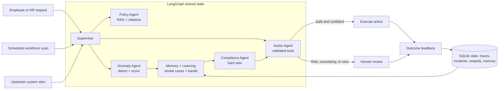

# Architecture Brief

## Purpose

The Agentic HCM Workflow Engine is a self-healing HR operations platform that handles employee
requests, proactively scans workforce data, investigates upstream payroll or attendance alerts,
and improves its action proposals from human decisions and operational outcomes. It combines
grounded policy retrieval, explainable anomaly detection, guarded actions, human approval,
hard-veto compliance rules, episodic memory, and contextual-bandit learning.

## System context

The platform accepts three trigger classes:

- **Reactive:** natural-language policy questions and HR actions from employees or managers.
- **Scheduled:** recurring scans of the 1,000-record workforce dataset.
- **System-generated:** structured alerts emitted by mock payroll or attendance systems.

## Major components

| Component | Responsibility |
| --- | --- |
| **Supervisor Agent** | Classifies triggers and routes work through shared graph state. |
| **Policy Agent** | Retrieves relevant policy chunks and produces citation-grounded answers. |
| **Anomaly Detection Agent** | Detects peer-cohort payroll outliers, excessive leave, missing training, and overtime breaches with explainable confidence scores. |
| **Memory and Learning** | Retrieves similar incidents and uses a reward-weighted contextual bandit to adjust proposed actions and confidence. |
| **Compliance Agent** | Evaluates 12 external JSON rules and issues hard vetoes that learned behavior cannot override. |
| **Action Agent** | Validates tool arguments, executes safe mock HR actions, or creates a human approval case. |
| **SQLite State Store** | Persists conversations, graph transitions, incidents, approvals, feedback, rewards, and episodic vectors across restarts. |
| **Streamlit UI / CLI** | Exposes employee requests, workforce scans, review decisions, learning diagnostics, traces, and automation commands. |

## Processing and control flow

Conversational requests use deterministic routing before invoking a model. Policy questions pass
through retrieval and relevance gating; unsupported questions fail safely. Structured leave and
payslip requests use schema-validated tools. Scheduled and system-generated signals follow the
self-healing workflow: detection → memory and learning → compliance → action. Agents do not call
one another directly; LangGraph owns every handoff and records it in shared state.

Anomaly proposals above the default `0.90` confidence threshold may execute automatically when
compliance allows them. Lower-confidence proposals and all vetoed proposals enter human review.
Reviewers can approve, modify, or reject; outcome feedback records whether the issue resolved,
recurred, or was a false positive.

## Learning and memory

The contextual bandit is used because the decision is a small discrete action choice with sparse,
immediate feedback. Human approval produces `+1.0`, modification `+0.5`, rejection `-1.0`, and a
compliance veto `-1.0`; execution outcomes provide additional rewards or penalties. A
256-dimensional feature-hashed episodic vector retrieves up to three similar prior incidents.
Positive experience can adjust confidence by at most `+0.12`, preventing limited feedback from
overriding detector evidence. Compliance always evaluates the learned proposal afterward.

## Data, observability, and deployment

The demo uses a synthetic employee CSV, a normalized policy corpus and persisted embedding index,
an external compliance rules file, a mock API specification, and mock HR tools. Every workflow
transition records agent input/output, latency, model tokens, cost, selected action, reward, and
tool calls. Deterministic scheduled scans use zero model tokens against the defined 1,350-token
naive baseline.

The current deployment is a single Python process with Streamlit, LangGraph, local model clients,
and SQLite. A production deployment should add authenticated APIs, role-based authorization,
encryption and PII controls, idempotent tools, managed transactional storage, a production vector
database, background scheduling, approval timeouts, and authoritative jurisdiction-specific HR
policies.
